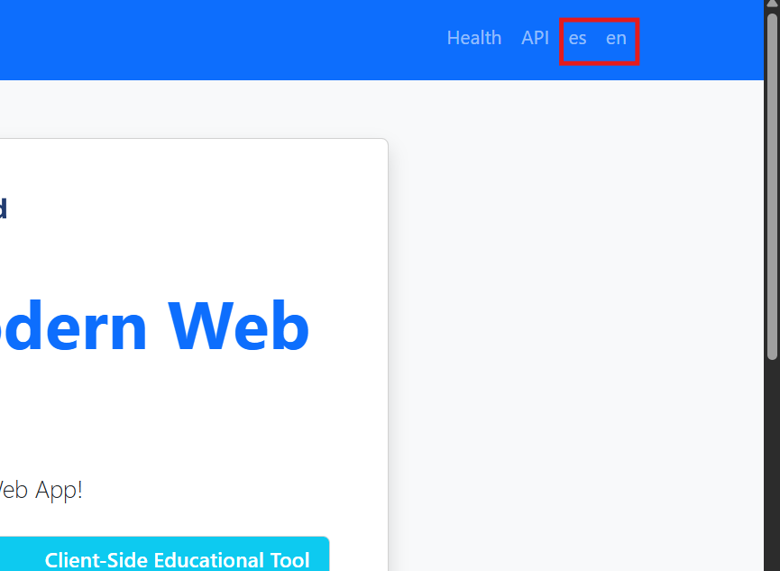

# Lab 1 Git Race -- Project Report

## Description of Changes
### Multi Language Support
We added support for english and spanish. Two buttons were added on the top right corner to switch between languages.



If the user clicks on one of the lamguage button, every text on the web will be translated to the selected language.
To implement this feature we used the messages_xx.properties files, where xx is the code of the language.
|code|language|
|----|--------|
|en  |English |
|es  |Spanish |

The messages.properties file is used as a default file, in case the language is not supported. Doing this, adding a new langague will be as easy as adding a new mwssages_xx.properties file.
So that the HTML files use these properties files, we used thymeleaf syntax to reference the properties. For example, in our messages_en.properties file we have the following line:
```title.greeting=Welcome to Modern Web App```
To read this property in our html we used:
```<h1 th:text="#{title.greeting}"></h1>```

To change the current languge of the web, we add ```/?lang=xx``` to the URI, where xx is again the code of the language. With this code the html will read the messages_xx.properties file.
To change the URI when the user clicks on one of the language buttons we send a URI request this is how:
```HTML
<a class="nav-link" th:href="@{/(lang=es)}"> es </a>
<a class="nav-link" th:href="@{/(lang=en)}"> en </a>
```
---
## Technical Decisions
To enable multi language support in our web we have created a new controller. This controller is in charge of the configuration of the locale resolver and the local change interceptor. Local resolver is the componente that determines the current language, and the local change interceptor is the component that intercpets the request to change the language.
The default language is in english because when we initialize the locale resolver we set english as the default language.
```java
@Bean
    fun localeResolver() : LocaleResolver {
        var slr = SessionLocaleResolver()
        slr.setDefaultLocale(Locale("en"))
        return slr
    }
```
Also every test was duplicated to test if the web works in both languages.

## Problems/Difficulties
The main difficulty we found was to change every test, that was beacuase we had modified the html file and the way the messages were referenced. We had to simulate the message properties files in the unit tests so we used message source.
The other problem we faced was that the files in IntelliJ were not configured to use UTF-8 encoding, so every spanish accented character was nit displayed correctly. To solve this we changed the encoding of the files to UTF-8.

---
## Learning Outcomes
The main thing I have learned is the basics of Kotlin, since I had never used it before. Also I have learned the existence os Thymeleaf.
Also I have learned how multi language support works in web apps, I had previusly heard how to translate videogames but I had never implemented it, so the multi language suuport has been the main learning.

---
## AI Disclosure
### AI Tools Used
- ChatGPT
- Copilot (I think it was copilot, but I am not sure because I change my IDE form VSCode to IntelliJ, and there was a AI that suggested me code)

### AI-Assisted Work
- The work assited by AI was mainly the translations of every message in the web. Also it helped me to understand the error messages the tests were giving me, and it suggested me to use message source to simulate the message properties files in the unit tests. Also it helped me to do some translations in some part of the report.
- Part done with AI: 40%
- Part done without AI: 60%
- The AI did not write any code for me, only the messages source in the unit tests.

### Original Work
- The spanish tests were copied from the english tests and then modified to work in spanish. Every change in the html file was change by me and the code for the multi language controller was taken from this page(https://www.baeldung.com/spring-boot-internationalization) and from this video(https://www.youtube.com/watch?v=p3FPz7Edx80)
- First this I made was to search in google information about multi language support in web apps, then when I understood the basics of translation in web apps I searched to change the language in a spring boot app. After understanding the main conecpts I worte the code for the multi language controller and then I changed the html files to use the message properties files. Finally because of changing the messages in the html files, I had to correct every test to make them work again, and I also duplictated every test to test the web in spanish.